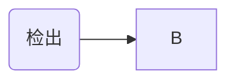

# Jenkins Pipeline设计

​	使用Jenkins搭建微服务平台Pipeline，实现代码提交后的编译、测试、部署等步骤，让开发人员可以快速、直观的得到有效反馈，达到微服务开发过程中持续交付、持续集成的目的。通过Pipeline固化交付和部署流程，解放人力，避免手工操作引起的错误和人员流动带来的交接问题。

## 相关工具

 - GitLab 版本管理
 - Maven 工程管理和整合
 - Nexus 制品管理
 - Sonar 代码质量管理
 - Docker 容器引擎

## Pipeline设计

​	DEV、SIT、UAT、TAG、PROD四个环境统一Pipeline步骤。

### DEV

​	DEV环境为开发测试环境，是开发人员开发和自测依赖的环境，我们要保证这个环境的完整性和时效性。DEV环境是持续集成的核心。

​	DEV环境流水线定义如下：

​	